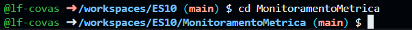

# Tutorial Coletando métricas com .NET

Este tutorial mostra como coletar métricas usando o .NET. Utilizamos o Codespaces do GitHub para simplificar a configuração do ambiente de desenvolvimento e evitar a necessidade de instalar manualmente o SDK do .NET e outras dependências.

### Iniciando o Codespaces no GitHub

Abra o Codespaces no repositório do GitHub para configurar seu ambiente automaticamente.


Figura 1: Iniciando Codespace no repositório do GitHub.

Após abrir o Codespace, você verá o ambiente de desenvolvimento integrado (IDE) diretamente no navegador.


Figura 2: Interface do IDE no GitHub Codespaces.

### Criando o Projeto de Console

No terminal integrado do Codespaces, execute o seguinte comando para criar um novo projeto de console:

```
dotnet new console -n MonitoramentoMetrica
```

Este comando cria uma nova pasta chamada MonitoramentoMetrica com um projeto de console básico.


Figura 3: Novo projeto criado

Navegue até o diretorio do projeto criado conforme imagem abaixo:



Figura 4: Acessando a pasta do novo projeto

### Adicionando o Pacote de Métricas

Agora precisamos adicionar referencias ao pacote `System.Diagnostics.DiagnosticSource`

Para utilizar as APIs de métricas, é necessário adicionar o pacote System.Diagnostics.DiagnosticSource à versão 8 ou superior. Para isso, execute o comando abaixo no projeto:

```
dotnet add package System.Diagnostics.DiagnosticSource --version 8.0.0
```

O comando adicionará o pacote ao projeto. Após a execução, você verá uma saída como esta no terminal:


Figura 5: Pacote de métricas adicionado ao projeto.

### Implementando o Código de Métricas

Agora implementamos no arquivo `Program.cs` o código necessário para realizar a coleta de métricas:

```C#
using System;
using System.Diagnostics.Metrics;
using System.Threading;

class Program
{
    static Meter s_meter = new Meter("HatCo.Store");
    static Counter<int> s_hatsSold = s_meter.CreateCounter<int>("hatco.store.hats_sold");

    static void Main(string[] args)
    {
        Console.WriteLine("Press any key to exit");
        while(!Console.KeyAvailable)
        {
            // Pretend our store has a transaction each second that sells 4 hats
            Thread.Sleep(1000);
            s_hatsSold.Add(4);
        }
    }
}
```

Agora nossa aplicação já está pronta para ser testada executando o comando `dotnet run` no terminal.


Figura 6: Aplicação executando


### Monitorando Métricas em Tempo Real
Agora, para exibir as metricas da nossa aplicação basta executarmos o seguinte comando em um novo terminal enquanto a aplicação esteja em execução:

```
dotnet-counters monitor --process-id <PID> HatCo.Store
```

**Nota:** Substitua o PID pelo ID do processo do seu aplicativo em execução. Você pode obter o PID listando os processos .NET em execução: `dotnet-counters ps`


Figura 7: Identificando ID do processo e coletando metricas

Após executar esses comandos você verá no seu terminal a coleta de métricas sendo realizada a cada segundo, conforme imagem abaixo:


Figura 8: Coletando métricas no terminal

